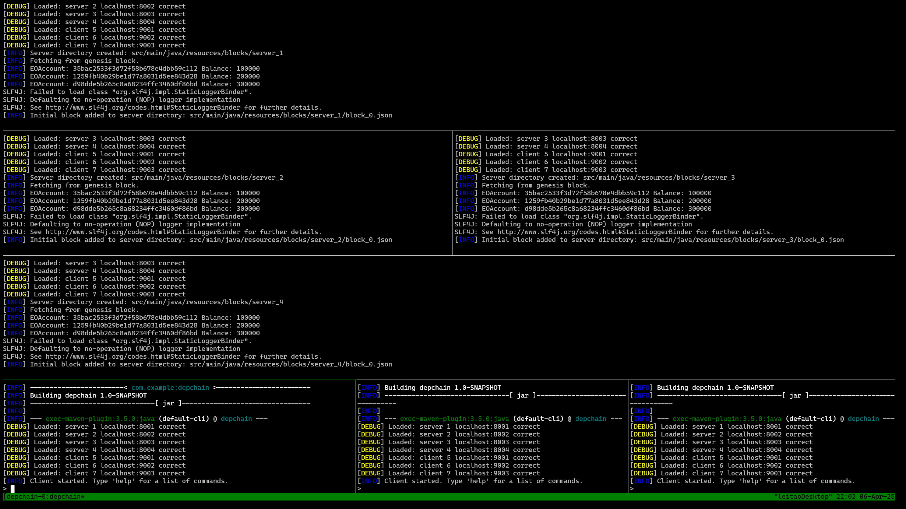

# DepChain - Highly Dependable Systems (2024-2025)

## Overview

DepChain is a simplified permissioned blockchain system with high dependability guarantees. This project is developed iteratively in two stages:

- **Stage 1**: Focuses on the consensus layer, specifically implementing a version of the Byzantine Read/Write Epoch Consensus algorithm.
- **Stage 2**: Targets the transaction processing layer, introducing a smart contract system for managing transactions (in ISTCoin token) and a native cryptocurrency DepCoin

## Features

- Static system membership with a pre-defined leader.
- Use of symmetric session keys and Public Key Infrastructure (PKI) for secure identity verification.
- Implementation of the Byzantine Read/Write Epoch Consensus algorithm.
- Support for Byzantine behavior among blockchain members and clients.
- UDP-based network communication with abstraction layers.
- Client interface for submitting transactions and state getters.

## Project Structure

```
depChain/
│── src/                        
│   ├── main/
|   |   ├── java/
│   |   |   ├── depchain/
│   |   |   |   ├── account/        # EOA and Smart contract accounts implementation
│   |   |   |   ├── blockchain/     # Blockchain related classes
│   |   |   |   ├── client/         # Client CLI for submitting transactions and the respective commands
│   |   |   |   ├── consensus/      # Byzantine Read/Write Epoch Consensus implementation
│   |   |   |   ├── library/        # Client library for submitting transactions
│   |   |   |   ├── network/        # UDP-based communication and message handling logic
│   |   |   |   ├── utils/          # Utility classes and helper functions
|   |   |   ├── resources/
|   |   |   |   ├── blocks/         # Contains the genesis block and other nodes' execution state
|   |   |   |   ├── config/         # Configuration files for several byzantine behaviors
|   |   |   |   ├── keys/           # Cryptographic keys
│   ├── test/
│   |   ├──  java/
│   |   |   ├── depchain/           # Unit and integration tests for the system
|   test.py                         # Test script for running the system
README.md                           # Project description and usage guide
report.pdf                          # Project report
```

## Installation and Setup

### Prerequisites

- Java Development Kit (JDK) 17+
- Maven

### Build and Run

To build the project:

```sh
mvn clean install
```

To run the system:

```sh
python3 ./depChain/test.py
```

### Configuration

Environment variables can be set in the `.env` file located in the root directory. The following variables are available:

- `CONFIG_FILE_PATH`: Path to the behavior configuration file.
- `KEYS_FOLDER_PATH`: Path to the folder containing cryptographic keys.
- `DEBUG`: Enable/disable debug mode.
- `BLOCKS_FOLDER`: Path to the folder containing the persisted blocks.
- `TRANSACTIONS_THRESHOLD`: Number of transactions to be processed in a block.

### Formatting

To format the code according to the project's style guide:

```sh
mvn formatter:format
```

## Testing

To run unit and integration tests:

```sh
mvn test
```

The test suite includes:

- Functional correctness tests for the consensus algorithm.
- Network reliability tests.
- Byzantine behavior simulations.

### Usage

You can run each behavior test individually by changing the `CONFIG_FILE_PATH` environment variable in the `.env` file for the desired configuration file located in the `src/main/java/resources/config/` directory.

Afterwards, run the test script:

```sh
python3 test.py
```

NOTE: you might need to first install `tmux`:

```sh
sudo apt install tmux -y
```

Then you can interact with the blockchain as a client:



## Design Considerations

- **Safety & Liveness**: The system ensures safety under all conditions and guarantees liveness only if the leader remains correct.
- **Client-Consensus Integration**: The client submits requests that are transformed into consensus proposals.
- **Security**: Cryptographic operations ensure message authentication and integrity.

## Future Work

- Implementing leader election and dynamic membership.
- Expanding transaction processing capabilities.
- Enhancing fault tolerance and security measures.

## Contributors

- Guilherme Leitão - ist199951
- Simão Sanguinho - ist1102082
- José Pereira - ist1103252

Group 12 - 2024/2025

Project developed for the Highly Dependable Systems course at Instituto Superior Técnico, University of Lisbon.

## References

[1] Introduction to Reliable and Secure Distributed Programming. 2nd Edition.
[2] Springer Computer Science Proceedings Guidelines: https://www.springer.com/gp/computer-science/lncs/conference-proceedings-guidelines
